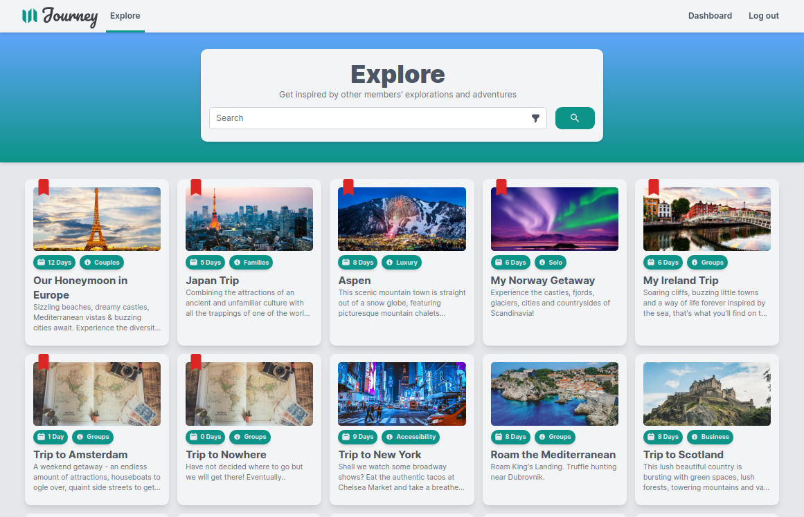
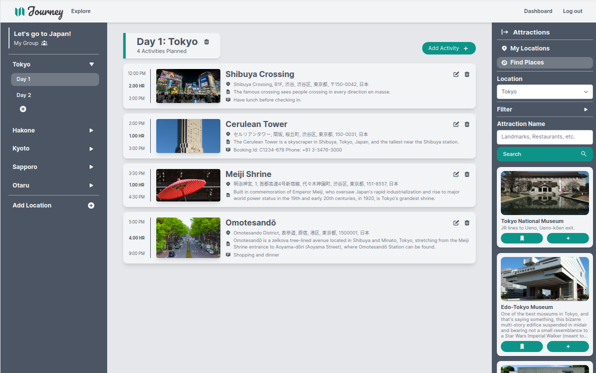
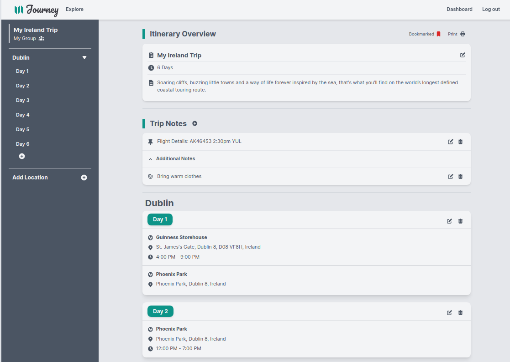
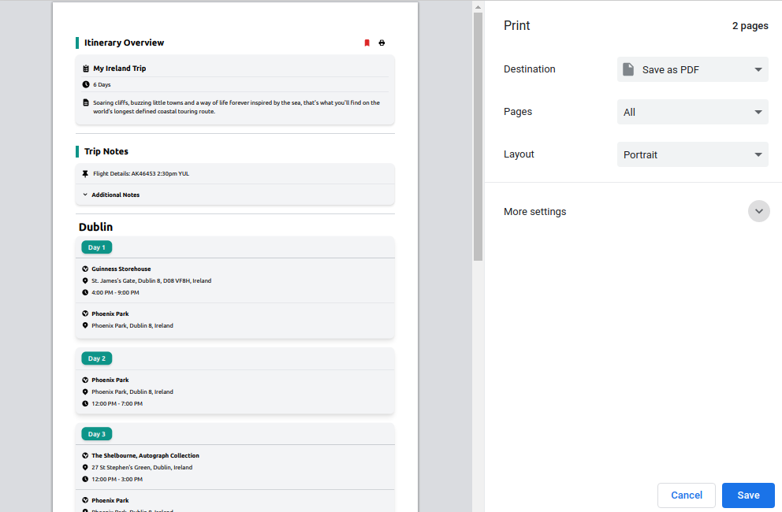

# Journey

## About

Journey is a single page app for creating trip itineraries for groups in real time, and browsing public itineraries for inspiration.

## Tech Stack

Front-end: React and TailwindCSS  
Back-end: Express, Node.js, PostgreSQL and Socket.io

## Final Product

## Getting Started

1. Create the `.env` by using `.env.example` as a reference

- Sign up for Triposo API Key (https://www.triposo.com/api/signup)

2. Install dependencies: `npm i`
3. Reset database (using Node v10.20.x): `npm run db:reset`
4. Start back-end server: `npm start` (or `npm run dev` to run in dev mode with nodemon integration)
5. Start the client/front-end server: `npm start`
6. Visit `http://localhost:8000/`

## Tips

- Use the `npm run db:reset` command each time there is a change to the database schema or seeds.
  - Note: in doing this, you will lose any newly created data (not in seed files), as the schema will tend to `DROP` the tables and recreate them.

## Main Dependencies

### Client

- Node (14.X) for React
- Axios (0.21.X)
- React (17.X)
- TailwindCSS (2.0.X)
- Socket.io-client (4.X)
- Craco (6.1.X)
- emailjs-com (2.6.X)
- react-router-dom (5.2.X)
- react-to-print (2.12.X)

### Back-end Server

- Node (14.X) for Express Server
- Node (10.20.X) for PostgreSQL
- Express (4.16.X)
- Axios (0.21.X)
- Socket.io (4.X)
- bcrypt (5.0.X)
- cookie-session (1.4.X)
- helmet (4.4.X)
- pg (8.5.X)
- pg-native (3.0.X)

## External APIs

- Triposo
- Nominatum
